# CollabEx System Architecture

This document provides visual diagrams of the CollabEx platform architecture, including system components, data flow, and integrations.

---

## 🏗️ High-Level System Architecture

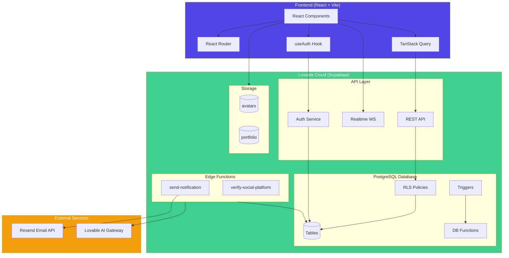

---

## 📊 Database Schema Relationships

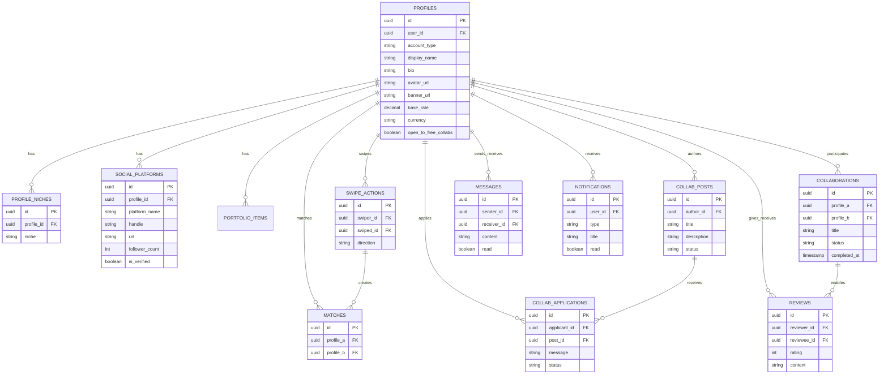

---

## 🔄 Core User Flows

### Authentication & Onboarding Flow

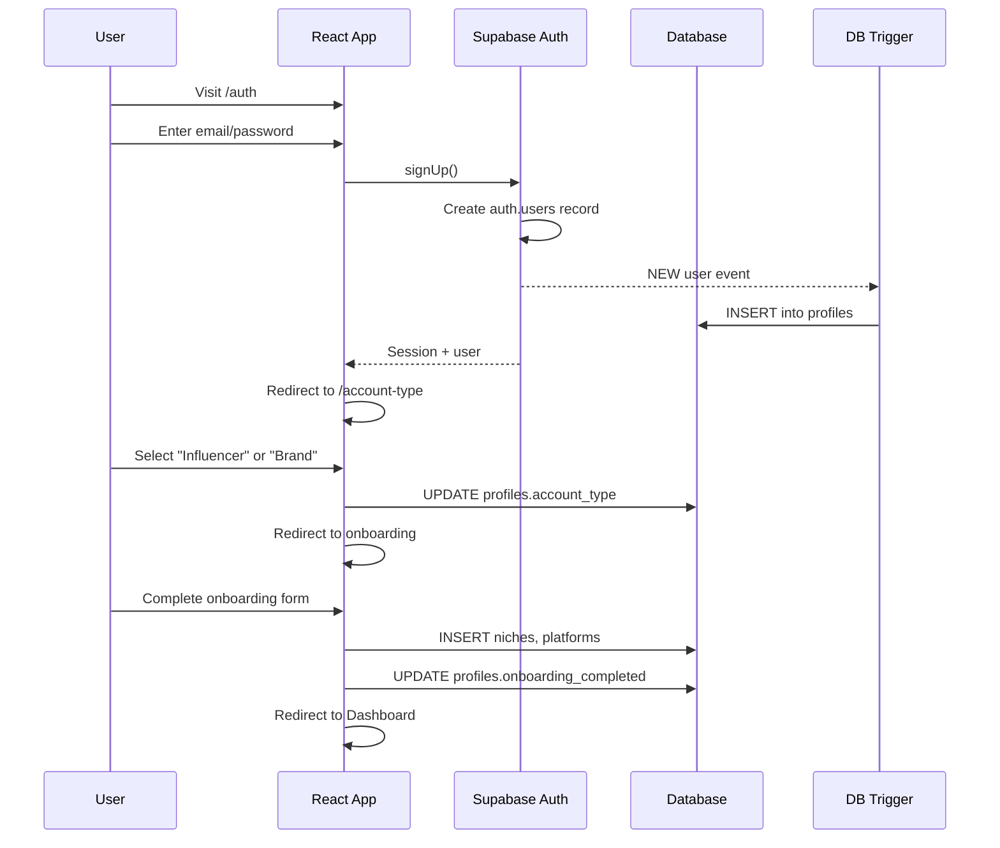

### Match Creation Flow

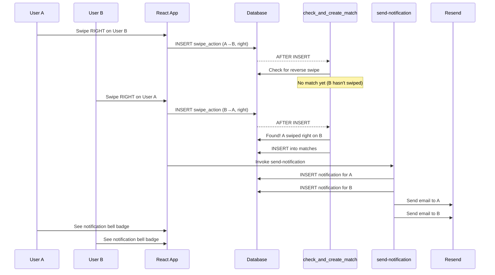

### Collaboration Lifecycle Flow

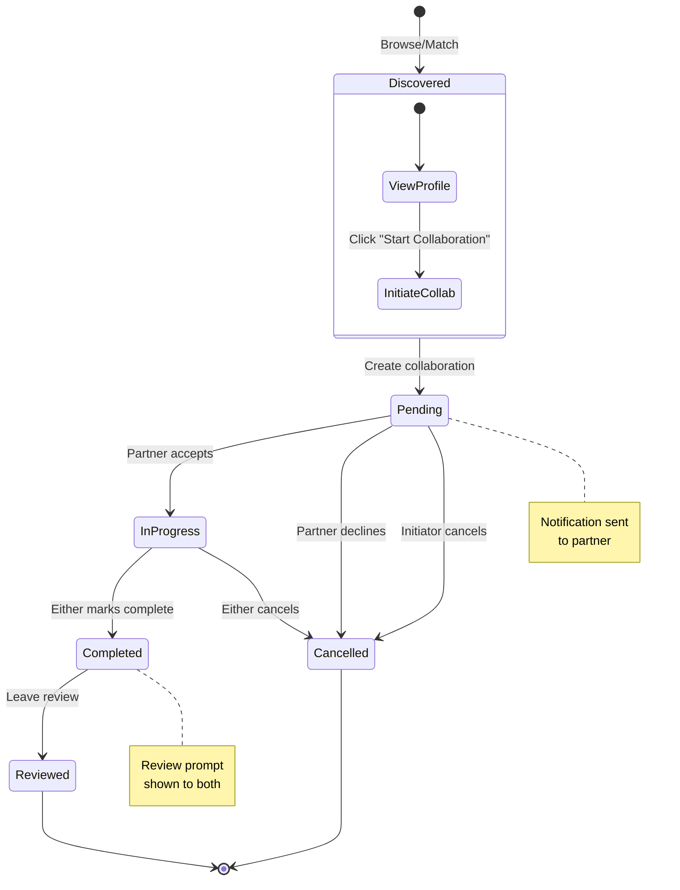

---

## 🔐 Security Architecture

### Row Level Security (RLS) Flow

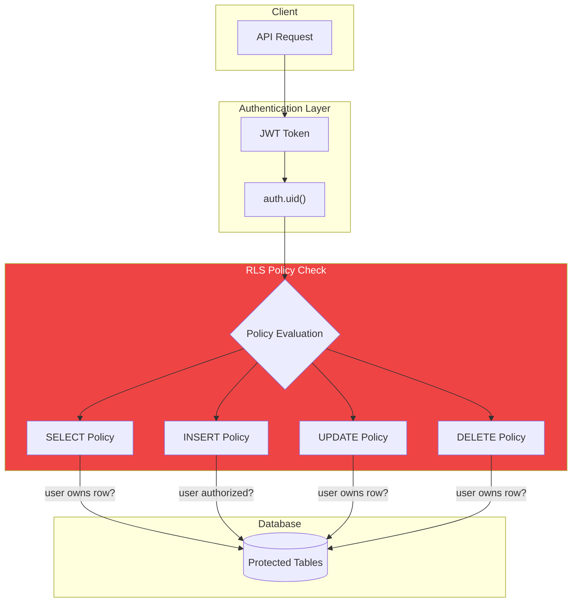

### Edge Function Security

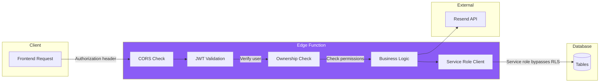

---

## 📱 Frontend Component Architecture

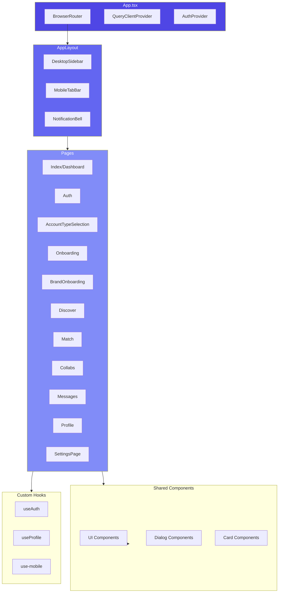

---

## 🔌 Integration Architecture

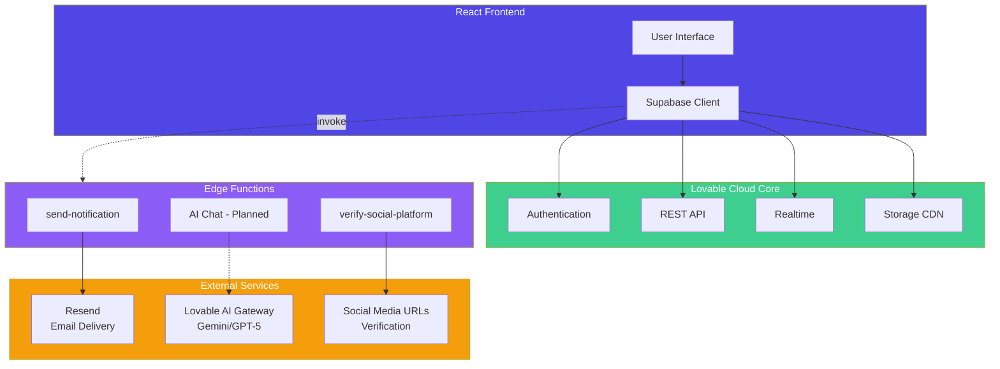

---

## 📨 Notification System Architecture

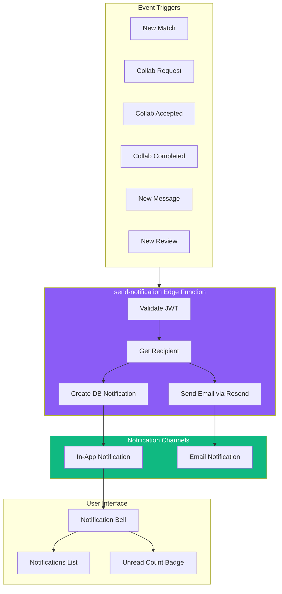

---

## 🗂️ File Structure Overview

```
collabex/
├── src/
│   ├── components/
│   │   ├── collaborations/     # Collab-related components
│   │   ├── layout/             # AppLayout, Sidebar, TabBar
│   │   ├── notifications/      # NotificationBell
│   │   ├── profile/            # Avatar, Banner, Niches, Social
│   │   ├── settings/           # PaymentSettings
│   │   └── ui/                 # shadcn/ui components
│   ├── hooks/
│   │   ├── useAuth.tsx         # Authentication state
│   │   ├── useProfile.tsx      # Profile data
│   │   └── use-mobile.tsx      # Responsive detection
│   ├── integrations/
│   │   └── supabase/
│   │       ├── client.ts       # Supabase client (auto-generated)
│   │       └── types.ts        # TypeScript types (auto-generated)
│   ├── pages/
│   │   ├── Index.tsx           # Dashboard
│   │   ├── Auth.tsx            # Login/Signup
│   │   ├── AccountTypeSelection.tsx
│   │   ├── Onboarding.tsx      # Influencer onboarding
│   │   ├── BrandOnboarding.tsx # Brand onboarding
│   │   ├── Discover.tsx        # Profile grid
│   │   ├── Match.tsx           # Swipe interface
│   │   ├── Collabs.tsx         # Board + active collabs
│   │   ├── Messages.tsx        # Chat
│   │   ├── Profile.tsx         # View profile
│   │   └── SettingsPage.tsx    # User settings
│   └── lib/
│       └── utils.ts            # Utility functions
├── supabase/
│   ├── config.toml             # Supabase configuration
│   └── functions/
│       ├── send-notification/  # Email + in-app notifications
│       └── verify-social-platform/  # Social URL verification
├── docs/
│   └── architecture.md         # This file
├── prd.md                      # Product Requirements Document
└── .lovable/
    └── plan.md                 # Feature implementation plan
```

---

## 🚀 Deployment Architecture

```mermaid
flowchart LR
    subgraph Dev["Development"]
        Local[Local Dev Server]
        Preview[Lovable Preview]
    end

    subgraph Build["Build Pipeline"]
        Vite[Vite Build]
        TypeCheck[TypeScript Check]
        Lint[ESLint]
    end

    subgraph Deploy["Deployment"]
        EdgeDeploy[Edge Function Deploy]
        StaticDeploy[Static Asset Deploy]
        DBMigrate[DB Migrations]
    end

    subgraph Prod["Production"]
        CDN[Lovable CDN]
        SupabaseProd[Supabase Prod]
        EdgeProd[Edge Functions]
    end

    Local --> Preview
    Preview --> Build
    Build --> Deploy
    Deploy --> Prod

    style Dev fill:#6366F1,color:#fff
    style Prod fill:#10B981,color:#fff
```

---

## 📈 Scaling Considerations

| Component | Current | At Scale | Strategy |
|-----------|---------|----------|----------|
| Database | Single Supabase instance | Connection pooling | PgBouncer enabled |
| Storage | Direct uploads | CDN-backed | Already using Supabase CDN |
| Edge Functions | On-demand | Warm instances | Monitor cold starts |
| Real-time | Single channel | Sharded channels | Per-conversation channels |
| Search | Sequential scan | Full-text search | Add pg_trgm indexes |

---

*Architecture diagrams generated for CollabEx - February 2026*
